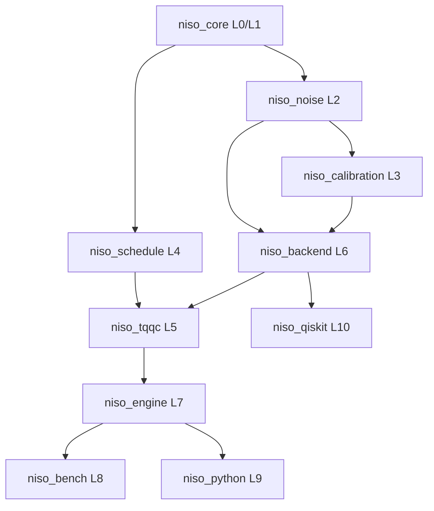

# NISO Unified Specification v1.1

**Project Name**: NISO (NISQ Integrated System Optimizer)  
**Version**: 1.1  
**Date**: 2025-12-17  
**Status**: Production Ready (Phase 5 Completed)  
**License**: MIT

---

## 1. Executive Summary

**NISO**는 NISQ (Noisy Intermediate-Scale Quantum) 장비에서 양자 알고리즘의 성능을 최적화하기 위해 설계된 Rust 기반 양자 제어 소프트웨어 플랫폼입니다. NISO는 독자적인 노이즈 저항 최적화 패러다임인 **TQQC (Temporal Noise Quantum Computing)**를 구현합니다.

### v1.1 주요 변경 사항

| 항목 | v1.0 | v1.1 |
|------|------|------|
| **License** | Apache-2.0 | MIT |
| **Test Coverage** | 349 | 350 |
| **IBM Integration** | Experimental | Stable |
| **Documentation** | Scattered | Unified |

---

## 2. Core Philosophy: TQQC

TQQC는 양자 노이즈를 단순히 수정해야 할 오류가 아닌, 탐색해야 할 **시간적 위상 편향 (coherent phase-bias / frame-drift) 파라미터 공간**으로 취급합니다.

### 핵심 가설

주어진 양자 회로 파라미터 $\theta$에 대해, 유효 노이즈 영향을 최소화하는 최적의 시간 진화 파라미터 $\delta$가 존재합니다.

### 방법론: DeltaSearch

`DeltaSearch`는 회로 실행 중 최적의 $\delta$를 능동적으로 탐색하는 적응형 알고리즘입니다.

```
                     ┌─────────────┐
                     │   θ ± δ     │
                     │   Probing   │
                     └──────┬──────┘
                            │
          ┌─────────────────┼─────────────────┐
          ▼                 ▼                 ▼
    ┌──────────┐      ┌──────────┐      ┌──────────┐
    │ Circuit+ │      │ Circuit- │      │ Baseline │
    │  θ + δ   │      │  θ - δ   │      │  θ + 0   │
    └────┬─────┘      └────┬─────┘      └────┬─────┘
         │                 │                 │
         └────────┬────────┴────────┬────────┘
                  ▼                 ▼
           ┌──────────┐      ┌──────────┐
           │  Parity  │      │ Compare  │
           │   ⟨P⟩    │─────▶│  Update  │
           └──────────┘      └────┬─────┘
                                  │
                                  ▼
                          ┌──────────────┐
                          │ Convergence? │
                          └──────────────┘
```

---

## 3. System Architecture

### 3.1 Layer Hierarchy

NISO는 모듈성, 테스트 가능성, 명확한 관심사 분리를 보장하기 위해 엄격한 계층화된 아키텍처를 따릅니다.

| Layer | Module | Responsibility |
|-------|--------|----------------|
| **L0** | `niso_core` | Foundation types (`QubitId`, `Angle`, `Probability`), Constants, Errors |
| **L1** | `niso_core` | `Circuit`, `Gate` definitions, `CircuitBuilder`, `Topology` validation |
| **L2** | `niso_noise` | Noise modeling (`NoiseModel`, `NoiseVector`), physical characteristics (`T1`, `T2`) |
| **L3** | `niso_calibration` | Hardware calibration data management, parsing, caching |
| **L4** | `niso_schedule` | Circuit scheduling (`ASAP`, `ALAP`), decoherence estimation |
| **L5** | `niso_tqqc` | TQQC Engine, `DeltaSearch` algorithm, `Parity` calculation, `StatisticalTest` |
| **L6** | `niso_backend` | Abstract execution interface (`BackendTrait`), `SimulatorBackend` |
| **L7** | `niso_engine` | Integration pipeline, high-level `NisoOptimizer`, `NisoConfig` |
| **L8** | `niso_bench` | Benchmark suites and reporting tools |
| **L9** | `niso_python` | Python bindings (PyO3) |
| **L10** | `niso_qiskit` | IBM Quantum integration, QASM transpilation, Job management |

### 3.2 Dependency Graph



---

## 4. Crate Specifications & APIs

### 4.1 Core & Physics

#### CircuitBuilder

Fluent API를 통한 양자 회로 구성:

```rust
use niso_core::prelude::*;

let circuit = CircuitBuilder::new(7)
    .h(0)
    .cx_chain()           // CNOT 체인 (0-1-2-3-4-5-6)
    .rz(0, 0.5)
    .measure_all()
    .build();
```

#### NoiseModel

$T_1$, $T_2$, 게이트 오류, 읽기 오류 정의. 이상적 기본값 또는 교정 데이터에서 인스턴스화 가능.

#### CalibrationInfo

하드웨어 상태의 스냅샷 저장. 시뮬레이션을 위한 정확한 노이즈 모델 생성 또는 TQQC에서 큐비트 매핑 가이드에 사용.

### 4.2 Logic

#### DeltaSearch

TQQC의 핵심. 패리티 측정을 기반으로 $\delta$ 파라미터를 반복적으로 조정.

| Strategy | Description |
|----------|-------------|
| `Fixed` | 일정한 스텝 사이즈 |
| `Adaptive` | 수렴 이력 기반 스텝 사이즈 조정 |

#### Parity

측정 카운트에서 패리티 기대값 $\langle P \rangle$을 계산. 최적화를 위한 비용 함수로 사용.

### 4.3 Execution

#### BackendTrait

```rust
trait BackendTrait {
    fn execute(&self, circuit: &Circuit, shots: u64) -> Result<ExecutionResult>;
    fn calibration(&self) -> Option<&CalibrationInfo>;
}
```

#### IbmBackend (niso_qiskit)

- **인증**: API Token 처리
- **스마트 트랜스파일링**: NISO `Gate` enum을 IBM 네이티브 기본 게이트(RZ, SX, CX)로 변환
- **배치 실행**: 처리량 최대화를 위해 단일 작업에서 최대 100개 회로 제출
- **복원력**: 503 오류 및 속도 제한 시 자동 재시도

### 4.4 Integration

#### NisoOptimizer

```rust
use niso_engine::prelude::*;

let config = NisoConfig::default_7q()
    .with_noise(0.02)
    .with_seed(42);

let mut optimizer = NisoOptimizer::new(config)?;
let result = optimizer.optimize()?;

println!("Improvement: {:.2}%", result.improvement_percent());
```

---

## 5. Key Workflows

### 5.1 TQQC Optimization Loop

1. **Initialize**: `NisoOptimizer`가 백엔드(Simulator 또는 IBM) 설정
2. **Calibration**: (선택) IBM에서 최신 교정 데이터를 가져와 내부 노이즈 모델 업데이트
3. **Baseline**: $\delta=0$으로 회로 실행하여 기준 성능 확립
4. **Loop**:
   - **Generate**: `TqqcEngine`이 현재 $\theta \pm \delta$로 `CircuitBuilder`를 사용하여 +/- 프로브 회로 생성
   - **Execute**: 회로가 `Backend`로 전송. IBM인 경우 배치 처리
   - **Measure**: 결과에서 패리티 계산
   - **Update**: `DeltaSearch`가 패리티를 비교하고 $\delta$ 방향 및 크기 업데이트
   - **Converge**: `Convergence` 기준(윈도우 안정성) 확인
5. **Result**: 최적 $\theta, \delta$ 및 개선 지표 반환

### 5.2 IBM Job Execution Pipeline

1. **Submission**: 사용자가 실행 요청
2. **Transpilation**: `niso_qiskit`이 회로를 OpenQASM 3.0으로 트랜스파일
3. **Packaging**: 여러 회로가 하나의 일반 `Job`으로 패킹
4. **Polling**: `JobManager`가 지수 백오프로 상태 폴링
5. **Completion**: 결과가 `Counts`로 파싱되어 반환

---

## 6. Configuration Reference

### NisoConfig

| Field | Type | Default | Description |
|-------|------|---------|-------------|
| `num_qubits` | usize | 7 | 큐비트 수 |
| `noise_level` | f64 | 0.02 | 노이즈 레벨 |
| `shots` | u64 | 4096 | 회로 실행당 샷 수 |
| `seed` | Option<u64> | None | 난수 시드 |
| `backend_type` | Enum | Simulator | `Simulator`, `IBM` |
| `backend_name` | String | - | e.g., `"ibm_brisbane"` |

### TqqcConfig

| Field | Type | Default | Description |
|-------|------|---------|-------------|
| `outer_loop` | usize | 100 | 외부 반복 횟수 |
| `inner_max` | usize | 10 | 최대 내부 반복 횟수 |
| `step_amp` | f64 | 0.1 | 초기 delta 스텝 사이즈 |
| `window` | usize | 3 | 수렴 체크 윈도우 사이즈 |
| `decay_rate` | f64 | 0.9 | 스텝 감쇠율 |
| `strategy` | Enum | Global | `Global`, `Layerwise` |

### TQQC Constants

| Constant | Value | Description |
|----------|-------|-------------|
| `THRESHOLD_5Q` | 0.030 | 5큐비트 임계값 |
| `THRESHOLD_7Q` | 0.027 | 7큐비트 임계값 |
| `Z_CRITICAL` | 1.645 | 단측 90% 신뢰 임계값 |

---

## 7. Performance & Results

### TQQC v2.2.0 on 7-qubit H-chain (Simulation)

| Metric | Result | Note |
|--------|--------|------|
| **Avg Improvement** | **12.13%** | p=0.02 (Significant) |
| Max Improvement | 19.82% | p=0.015 |
| Computation Saved | ~51% | Early stopping & dynamic loops |

### Test Coverage (v1.1)

| Category | Count |
|----------|-------|
| Total Tests | 350 |
| Passing | 350 |
| Ignored | 3 (IBM API) |

---

## 8. Installation

### Rust

```bash
git clone https://github.com/jungwookyang/niso.git
cd niso
cargo build --release
cargo test
```

### Python

```bash
pip install maturin
cd crates/niso_python
maturin develop --release
```

### IBM Quantum

```bash
export IBM_QUANTUM_TOKEN="your-api-token"
```

```rust
use niso_qiskit::prelude::*;

let backend = IbmBackend::from_env("ibm_brisbane")?;
let result = backend.execute_sync(&circuit, 4096)?;
```

---

## 9. Project Structure

```
niso/
├── Cargo.toml          # Workspace config
├── LICENSE             # MIT License
├── README.md           # Project overview
├── CONTRIBUTING.md     # Contribution guide
├── docs/               # Documentation
│   └── NISO_Unified_Specification_v1.1.md  (This file)
└── crates/
    ├── niso_core/      # L0-L1: Foundation + Circuit
    ├── niso_noise/     # L2: Noise modeling
    ├── niso_calibration/# L3: Hardware calibration
    ├── niso_schedule/  # L4: Circuit scheduling
    ├── niso_tqqc/      # L5: TQQC optimization engine
    ├── niso_backend/   # L6: Execution interface
    ├── niso_engine/    # L7: Integration pipeline
    ├── niso_bench/     # L8: Benchmark suites
    ├── niso_python/    # L9: Python bindings
    └── niso_qiskit/    # L10: IBM Quantum integration
```

---

## 10. Future Roadmap

| Phase | Description | Status |
|-------|-------------|--------|
| Phase 5 | IBM Hardware Integration | ✅ Completed |
| Phase 6 | Zero Noise Extrapolation | 🔜 Planned |
| Phase 7 | Multi-backend Parallelization | 🔜 Planned |

---

## 11. License & Author

**License**: MIT

**Author**: Jung Wook Yang (<sadpig70@gmail.com>)  
QC Technical Partner

---

*This specification supersedes all previous versions including NISO_Integration_Spec_v1.0.md*
